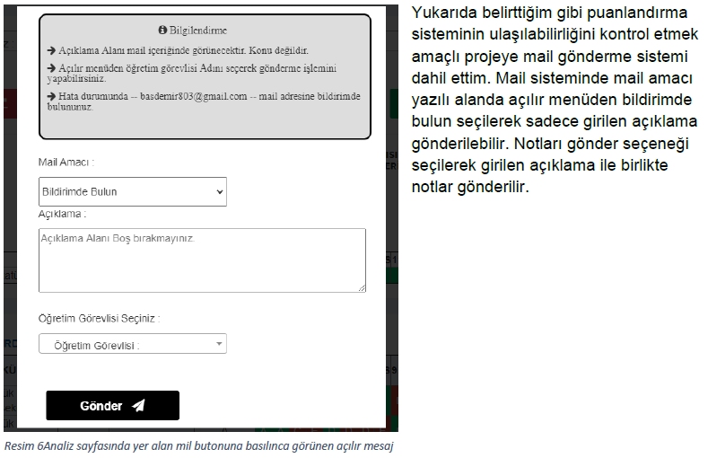

# Optik Form Okuma ve Değerlendirme Sitesi

### İÇİNDEKİLER
- PHP ,Codeigniter ve Framawork Nedir?
- Dosya Yükleme İşlemi Yapım Aşaması
- Excel Dökme İşlemi Yapım Aşaması
- Analiz İşlemi Yapım Aşaması
- Mail Gönderme İşlemi Yapım Aşaması
- Proje Görselleri
- Kaynak

## PHP Nedir ?
PHP Web Tabanlı, nesne yönelimli bir programlama dilidir. PHP, dinamik, kendi kendine yönetilebilir web siteleri yapılmasını sağlar. PHP'nin geliştirilmesi bugün PHP topluluğu tarafından sürdürülmektedir.

## Codeigniter Nedir?
Codeigniter Php ile dinamik web uygulamaları geliştirmek için geliştirilmiş bir frameworktür. Codeigniter’İ kullanmak için http://codeigniter.com/download sitesinden codeigniter paketi kurulmalıdır.

## Framework nedir?
Frameworkler bir çok yazılım projesinde ortak olarak bulunan yapıları içinde bulunduran ve bunu biz geliştiricilerin kullanımına açarak geliştirme aşamasında hız kazanmamızı sağlayan yazılım projeleridir. Framework yapısal anlamda tamamlanmış görünüm olarak geliştiricilerin veya kullanıcıların kendine özel olarak ayarladığı yapıdır.

## Codeigniter avantajları nedir?
- Codeigniter yaygın olarak ihtiyaç duyulan görevler için zengin bir kütüphane sunmanın yanı sıra bu kütüphanelere erişmek için basit bir ara yüz ve mantıktsal yapı sağlayarak, hızlı projeler geliştirilmesini sağlar.
- Codeigniter, yapılacak bir işlem için gereken kod miktarını en aza indirerek projeye yaratıcı bir şekilde odaklanılmasını sağlar.
- Codeigniter hafif (çok fazla kaynak tüketmeyen) bir frameworktür. Core sistem sadece birkaç küçük kütüphane gerektirir(Daha fazla kaynak tüketen diğer frameworklerin aksine). Codeigniter belirli bir işlem için geliştiricinin ihtiyaçlarını temel alır ve istek üzerine kütüphaneler dinamik olarak yüklenir, bu nedenle temel sistem oldukça yalın ve oldukça hızlıdır.
Template website Nedir ?
Template(Hazır) web sitesi bir kez oluşturulup birden çok kullanıcıya satılan içerik ve temaları hazır olan sistemlerdir. Projede kullanılan Adminlte’de bunlardan biridir

## Proje yapımı aşamaları

1)Adminlte temasının kurulumundan sonra karşımıza gelen ilk ekran bu şekilde olacaktır tema içerisindeki menü, mesaj bildirimler kısmını ayrı sayfalar halinde kaydettim böylece yeni sayfa oluşturmak istediğimizde çağırma işlemini yaparak menu ve diğer sayfaları oluşturacağımız sayfaya eklemiş olacağız.

2)Sayfaları ayırma işleminden sonra menu.php dosyasında menü içeriğini değiştirerek projeme uygun şekilde ayarladım.

3)Dosya yükleme sayfası için dosyayukle.php sayfası açıp içerisine dosya yükleme işlemi için üç adet buton koydum ayrıca seçilen excel verilerinin yüklenmesi için -PHPExcel- kütüphanesini kullandım.

Yukarıda yer alan kod ile seçilen Excel dosyası yükleme için oluşturduğum ayrı bir controllere gönderilir. Alt tarafında yer alan kod yapısı fakulteyukle.php controller dosyasının içeriğidir. Buraya gönderilen excel dosyası parçalanır. Kod yapısını incelersek $fakulte adlı değişken excelde 1.sütun verilerini alır diğer değişkenlerde verileri aldıktan sonra bir array içerisine aktarılır ve insert komutu ile mysql’e aktarma işlemi gerçekleşir.

####  - Mysql Sunucusuna bağlanmak için application/config/database.php dosyasında mysql sunucunuza bağlantı ayarları için gerekli ayarlamaları yapmanız gerekmektedir.

4) Analiz sayfasının yapımı için analiz.php dosyası oluşturdum içerisine kullanıcıların analiz verilerini seçmesi için -Select2- yapısından dört adet açılır menü koydum. Daha sonra kullanıcının analiz işlemlerini tamamladıktan sonra kolaylık sağlamak için verileri pdf ve excel olarak indirme seçeneği analiz yapılan verilerin not durumunu daha kolay anlamak için verilerin grafiklendirme son olarak notların kullanıcıya mail olarak gönderilmesi içim mail gönderme butonu ekledim.

#### -  verilerin excele dökülmesi

Ana ekrandaki tablo PHPExcel kütüphanesine gönderilerek parçalama işlemi yapılır daha sonra home controllerine parçalanmış tablo burada okunur. Bir array oluşturup array indislerini excelde başlık olarak görünecek sekilde ayarladım daha sonra parçalanan verileri array içine atark verilerin excelde kaçıncı sütuna geleceğini ayarladım.

#### -  Analiz işleminin yapılması

Kullanıcın açılır menüden yaptığı seçimleri home controllerde post işlemi alıp sorgu çekerek mysql’den verileri çekip analiz işleminin yapılması için ayrı bir sayfa olan analizVeri.php sayfasına veri gönderme işlemi yaptım. analizVeri şeklinde yeni bir sayfa oluşturmamın amacı projenin kilit noktası olan bu kısım için karışık yapıdan kaçınmak ve pdf alma gibi işlemlerde kolaylık sağlamak amaçlıdır.

#### -  analizVeri.php içeriği

Home contollerden analizVeri.php sayfasına gönderilen verileri foreach döngüsü ile tabloya aktardım daha sonra karşılaştırma işlemi yaparak yanlış cevapların kırmızı doğru cevapların yeşil renkte görünmesini ve her doğru seçenek için foreach içerisinde tanıttığım $not değişkenini beş puan artırarak notlandırma sistemini yaptım.

#### (TC Kimlik numaraları test işlemleri için rastgele üretilmiştir)

#### - Mail Gönderme işlemi

Mail gönderme işleminde home/mailAt fonksiyonu çalışır yapılan tercihlere göre sorgu işlemleri yapılır ve <<<EOF komudu ile tablo oluşturulur bu kodun amacı html içerisinde php kodu kullanmaktır. Alınan verilerle birlikte $mesaj değişkeni tamamlanır ve google’dan alınan uygulama şifresi ile mail atılır.(mail kodları kısaltıldı kısaltılan yerler --- şeklinde belirtildi.

### - Proje Görselleri

### Not : Menü içeriğinde yer alan “Verileri Temizle” Seçeneği görsel içermediğinden dolayı resim eklenmedi.

## KAYNAK

1. https://arjunphp.com/how-to-use-phpexcel-with-codeigniter/
2. https://www.kodingmadesimple.com/2018/03/codeigniter-generate-pdf-from-view-dompdf.html
3. https://www.webslesson.info/2017/10/add-remove-select-box-fields-dynamically-using-jquery-ajax-in-php.html
4. https://stackoverflow.com/questions/19044922/how-to-get-the-dropdown-selected-value-and-send-it-to-controller-in-codeigniter
5. https://codepen.io/
6. https://canvasjs.com/php-charts/
7. https://codeigniter.com/user_guide/helpers/url_helper.html
8. https://www.plus2net.com/php_tutorial/pdf-data-student.php
9. https://www.webslesson.info/2017/07/live-add-edit-delete-datatables-records-using-php-ajax.html
10. https://www.webslesson.info/2017/05/bootstrap-multi-select-dropdown-with-checkboxes-using-jquery-in-php.html
11. https://codeigniter.com/user_guide/libraries/email.html
12. https://codeigniter.com/userguide3/libraries/file_uploading.html
13. https://www.youtube.com/watch?v=y5Laez31IYw
14. https://stackoverflow.com/questions/31411514/send-file-by-jquery-ajax-to-a-codeigniter-controller
15. https://www.w3schools.com/php/func_filesystem_file_get_contents.asp
16. https://fontawesome.com/v4.7.0/icons/
17. https://makitweb.com/loading-data-remotely-in-select2-codeigniter/
18. https://makitweb.com/how-to-get-records-from-database-with-angularjs-in-codeigniter/
19. https://www.webslesson.info/2020/05/make-editable-datatable-using-jquery-tabledit-plugin-with-php-ajax.html

